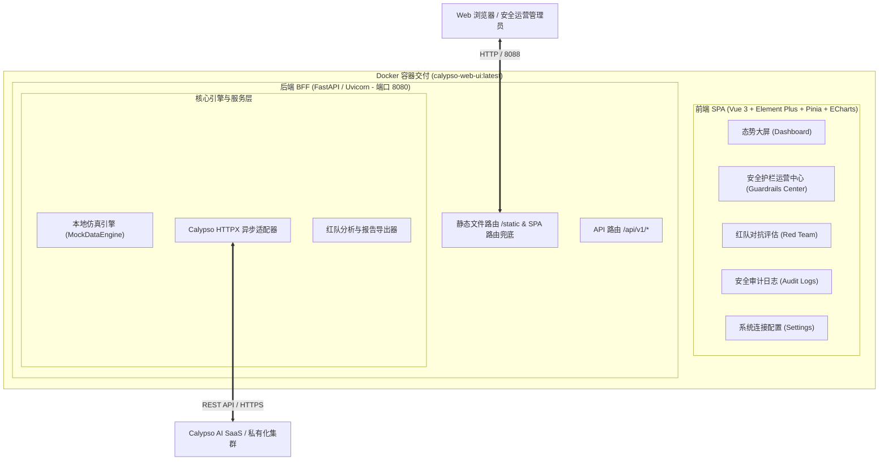

# Calypso AI 中文界面 (Calypso AI Chinese Web UI)

<p align="center">
  
  
  
  
  
  
</p>

<p align="center">
  <strong>专为大语言模型 (LLM) 安全防护、护栏规则运营与红队对抗评估打造的企业级全中文管理控制台</strong>
</p>

---

## 📖 项目简介

**Calypso AI 中文界面 (Calypso AI Chinese Web UI)** 是一套针对大模型 (LLM) 应用安全落地所研发的开箱即用、生产级 Web 运营控制台。

项目深度对接全球领先的大模型安全平台 **Calypso AI**（支持 SaaS 集群与私有化私有集群），提供全中文、交互流畅、专业易用的可视化安全运营工作台。无论是安全运营团队日常监控护栏拦截，还是开发团队调试大模型提示词策略，亦或是红队专家评估模型脆弱性，均可通过本平台实现一站式管控。

---

## ✨ 核心特性

### 1. 🛡️ 安全态势大屏 (Security Dashboard)
- **核心安全指标实时看板**：即时统计安全扫描总量、放行合规率、高危阻断量及网关拦截率。
- **真实分时流量趋势图**：双线渐变面积图清晰展现每小时扫描总量与拦截量的时间分布。
- **Calypso 原生扫描器违规占比 (Donut Chart)**：环形比例透视恶意诱导、非法监控、越狱逃逸、提示词注入与系统词防泄等细分规则命中权重。
- **AI 安全防御指数与效能雷达 (Security Posture Radar)**：六维雷达图结合护栏响应时延（ms）动态评测模型在对抗韧性、敏感信息防泄、越狱拦截等维度的综合防御水准。
- **业务项目联动切换**：支持在全局视角与专属业务项目视角间实时切换。

### 2. 🎛️ 安全护栏运营中心 (Guardrails Center)
- **实时护栏测试台 (Playground)**：
  - **目标业务项目绑定**：支持选择指定业务项目（如 `guardrail_for_dify`）并一键应用项目参数，请求严格路由至对应项目上下文。
  - **典型攻防样本预设 (Presets)**：内置系统指令劫持 (G01)、DAN 越狱 (G03)、API Key 泄露 (G05)、Base64 混淆 (G07)、敏感个人信息脱敏 (G08)、金融合规咨询 (G10) 等经典用例。
  - **下游大语言模型响应卡片 (LLM Gateway Response)**：
    - **合规放行**：展示下游模型徽章（如 `🤖 deepseek-v4-pro-ga-260813`）、Token 消耗明细（提问/生成/总计）、展开式思维链（Reasoning Process）与模型完整回答。
    - **阻断拦截**：呈现网关拦截红牌告示、拦截动作（Drop Request）以及结构化处置报文。
    - **Raw 报文抽屉**：一键呼出 Calypso 原生完整 JSON 报文，核验规则置信度与扫描明细。
- **业务项目与规则绑定 (Project Management)**：支持创建与管理业务项目空间，查看各项目生效规则列表。
- **Guardrails 规则库 (Rule Library)**：集中展示多维度安全扫描器，包含规则标识、版本与功能描述。
- **护栏检测日志流 (Guardrails Logs)**：按项目、检测判定结果（合规通过、高危阻断、合规脱敏、预警标记）检索历史流水，支持一键查看单次判定的原始报文与规则命中情况。

### 3. 🎯 红队对抗评估与报告中心 (Red Team Benchmark & Reports)
- **评测报告清单与状态监控**：多维透视红队演练活动（Campaigns），直观展示任务生命周期（已完成 / 运行中 / 正在取消 / 异常）。
- **Calypso 原生 Raw Data 抽屉**：全量查看红队演练的 `campaignRun`、`attackRuns`、`converters` 及事件序列，支持一键复制与离线下载。
- **自动化分析与报告导出**：支持导入主流红队评测数据（CSV / JSON / Excel）并一键导出 Word / Markdown 格式评估报告。

### 4. 📜 全量安全审计日志 (Audit Logging)
- 记录每次检测扫描的时间戳、所属项目、判定动作、输入提示词摘要、脱敏前后比对及客户端上下文，满足企业合规审计与追溯要求。

### 5. ⚡ 双模式无缝切换 (Online / Demo Mode)
- **在线连接模式 (Online Mode)**：填入 Calypso Base URL 与 API Token，直连企业 Calypso SaaS 或私有化实例。
- **离线演示模式 (Demo Mode)**：内置智能仿真引擎，免 Token 开箱即用，完整还原所有界面与图表交互，适合 POC 演示与离线评估。

---

## 🏗️ 系统架构



---

## 🚀 快速启动

### 方式一：Docker 单容器运行（推荐）

直接通过官方构建脚本运行独立容器：

```bash
cd calypso-web-ui

# 1. 配置环境变量 (可选，不配置默认启动离线 Demo 模式)
cp .env.example .env
# 编辑 .env 填入你的 CALYPSO_BASE_URL 和 CALYPSO_API_TOKEN

# 2. 一键构建并启动容器 (映射宿主机 8088 端口)
./run.sh build
./run.sh start
```

访问浏览器：**`http://localhost:8088`** 即可进入控制台！

### 方式二：Docker Compose 一键启动

```bash
cd calypso-web-ui
docker compose up -d --build
```

### 方式三：容器便捷管理脚本 `run.sh`

```bash
./run.sh start       # 启动容器
./run.sh stop        # 停止容器
./run.sh restart     # 重启容器
./run.sh status      # 查看运行状态
./run.sh logs        # 实时跟踪日志
./run.sh build       # 重新编译前端并构建镜像
```

### 方式四：本地开发调试

#### 1. 后端 BFF (FastAPI)
```bash
cd calypso-web-ui
python3 -m venv venv
source venv/bin/activate
pip install -r requirements.txt

# 启动后端服务 (端口 8080)
uvicorn app.main:app --host 0.0.0.0 --port 8080 --reload
```

#### 2. 前端 (Vue 3 + Vite)
```bash
cd calypso-web-ui/web
npm install
npm run dev
# 浏览器访问 http://localhost:5173
```

---

## ⚙️ 环境变量配置说明

复制 `calypso-web-ui/.env.example` 为 `calypso-web-ui/.env`：

| 变量名 | 默认值 | 说明 |
| :--- | :--- | :--- |
| `CALYPSO_BASE_URL` | `https://us1.calypsoai.app` | Calypso AI 服务端点基准地址 |
| `CALYPSO_API_TOKEN` | *空* | Calypso AI API Token 凭据 |
| `APP_MODE` | `online` | 运行模式：`online` (直连模式) 或 `demo` (离线演示模式) |
| `PORT` | `8080` | 容器内部监听端口 |

> **安全提示**：请勿将包含真实 `CALYPSO_API_TOKEN` 的 `.env` 文件提交至公开代码仓库。控制台亦支持在「系统与连接配置」页面直接动态录入 Token，密钥仅存储在客户端本地 Session 中。

---

## 🔌 REST API 接口概览

后端提供规范的 `/api/v1` 前缀路由接口：

| 方法 | 路径 | 功能说明 |
| :--- | :--- | :--- |
| `GET` | `/api/v1/system/status` | 系统健康与连接状态检查 |
| `POST` | `/api/v1/system/test-connection` | 测试 Calypso AI 连通性 |
| `POST` | `/api/v1/system/config` | 动态切换运行模式 (Online / Demo) |
| `GET` | `/api/v1/dashboard/metrics` | 获取大模型安全度量指标与时序趋势 |
| `GET` | `/api/v1/guardrails/rules` | 获取已注册 Guardrails 扫描规则列表 |
| `POST` | `/api/v1/guardrails/scan` | 发起提示词实时安全扫描与规则评估 |
| `GET` | `/api/v1/guardrails/logs` | 获取指定项目或全局的护栏检测流水日志 |
| `GET` | `/api/v1/projects` | 获取企业业务项目空间列表 |
| `GET` | `/api/v1/redteam/campaigns` | 获取红队演练任务及报告概览清单 |
| `GET` | `/api/v1/audit/logs` | 获取系统审计日志列表与明细 |

---

## 🧪 自动化测试

项目具备完备的单元测试与 API 集成测试覆盖：

```bash
cd calypso-web-ui
PYTHONPATH=. pytest tests/ -v
```

**测试结果**：37 项测试 100% 全部通过，覆盖 API 端点、Mock 离线引擎、项目级规则匹配、指标聚合以及 Calypso HTTPX 传输适配器。

---

## 📂 项目结构

```text
calypso-web-ui/
├── app/                        # FastAPI BFF 后端服务
│   ├── api/                    # REST API 路由 (dashboard, guardrails, redteam, audit, projects)
│   ├── services/               # 业务逻辑层 (CalypsoClient, MockDataEngine, Aggregator)
│   ├── config.py               # 环境变量与配置管理
│   └── main.py                 # FastAPI 入口与静态文件挂载
├── web/                        # 前端单页应用 (Vue 3 + Vite)
│   ├── src/
│   │   ├── api/                # Axios API 请求封装
│   │   ├── components/         # 公共 UI 组件 (MetricCard, DiffViewer)
│   │   ├── views/              # 核心业务页面 (Dashboard, GuardrailsCenter, RedTeam, AuditLogs, Settings)
│   │   │   └── guardrails/     # 护栏中心子模块 (Playground, ProjectList, RuleLibrary, GuardrailsLogs)
│   │   └── stores/             # Pinia 状态管理
│   ├── package.json
│   └── vite.config.js
├── tests/                      # Pytest 自动化测试套件
├── Dockerfile                  # 多阶段生产级 Docker 镜像定义
├── docker-compose.yml          # Docker Compose 编排文件
├── run.sh                      # 容器一键管理脚本
├── requirements.txt            # Python 依赖包声明
└── .env.example                # 环境变量配置模板
```

---

## 📄 开源许可证

本项目基于 [Apache License 2.0](LICENSE) 协议开源。
