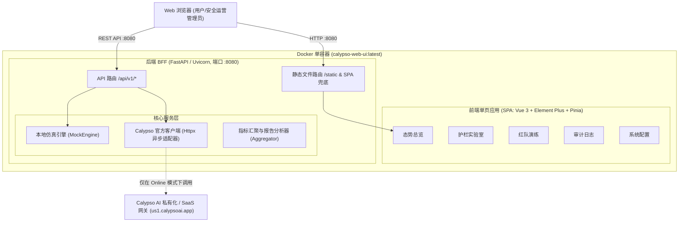

# Calypso AI 中文安全运营与体验控制台

<p align="center">
  <strong>专为大模型应用安全防护、合规审计与红队对抗打造的企业级中文运营控制台</strong>
</p>

---

## 目录

- [项目概述](#项目概述)
- [核心特性](#核心特性)
- [系统架构](#系统架构)
- [快速开始](#快速开始)
  - [方式一：Docker 单容器运行（推荐）](#方式一docker-单容器运行推荐)
  - [方式二：Docker Compose 一键编排](#方式二docker-compose-一键编排)
  - [方式三：本地开发与调试](#方式三本地开发与调试)
- [管理脚本 `run.sh`](#管理脚本-runsh)
- [环境变量与配置说明](#环境变量与配置说明)
- [REST API 接口概览](#rest-api-接口概览)
- [项目目录结构](#项目目录结构)
- [自动化测试与验证](#自动化测试与验证)

---

## 项目概述

**Calypso AI 中文安全运营与体验控制台**是一套面向企业大语言模型（LLM）应用安全落地的轻量级、开箱即用 Web 解决方案。

系统底层依托 Calypso AI 领先的大模型护栏（Guardrails）与红队测试评测能力，前端采用现代化的 Vue 3 + Element Plus 构建全中文可视化界面，后端采用高性能 FastAPI BFF（Backend-for-Frontend）架构，支持**离线全功能演示（Demo 模式）**与**在线企业级 API 联动（Online 模式）**无缝切换。

---

## 核心特性

1. **双模无缝驱动（Demo / Online Mode）**：
   - **离线体验模式（Demo）**：内置智能仿真引擎，开箱提供预设攻击用例、脱敏规则、动态态势指标与演练数据，无需配置 API Token 即可离线体验完整交互流程。
   - **在线连接模式（Online）**：对接私有化或 SaaS 版 Calypso AI 官方 REST API，实时透传企业模型网关请求与扫描结果。
2. **安全护栏攻防实验室（Guardrails Playground）**：
   - 支持实时输入检测、提示词注入（Prompt Injection）、越狱规避（Jailbreak）、敏感信息/机密泄露（Secrets & PII）、编码混淆对抗等攻防测试。
   - 直观展示命中规则、违规置信度、风险等级与自动脱敏（Redaction）效果。
3. **安全运营监控大盘（Security Dashboard）**：
   - 集中呈现请求总量、阻断拦截率、高危事件数与平均响应耗时指标卡。
   - 违规分类分布饼图、24 小时风险请求时序趋势图、实时告警动态流。
4. **红队演练与漏洞挖掘中心（Red Team Benchmark）**：
   - 评测活动（Campaigns）多维透视与脆弱性得分统计。
   - 支持上传评测结果报告（CSV / JSON / Excel）进行深度自动化归因分析，一键导出安全评估报告。
5. **审计合规与全量追溯日志（Audit Logging）**：
   - 完整记录每次扫描的请求上下文、触发规则、处置决策（允许 / 阻断 / 警告）、执行耗时与客户端 IP。
   - 支持时间区间、处置状态、关键词组合过滤，提供侧边抽屉全量 Payload 展开审阅。
6. **生产级单容器交付（Multi-Stage Docker Packaging）**：
   - Node 20 编译前端静态单页应用，嵌入 Python 3.11 极简轻量镜像，实现单端口（8080）统一代理与 SPA 路由。

---

## 系统架构



---

## 快速开始

### 方式一：Docker 单容器运行（推荐）

通过预制管理脚本直接构建并启动容器：

```bash
# 1. 进入项目根目录
cd calypso-web-ui

# 2. 构建生产镜像
./run.sh docker-build

# 3. 启动后台容器 (映射宿主机 8080 端口)
./run.sh docker-run
```

或使用标准 Docker 命令手动运行：

```bash
# 构建镜像
docker build -t calypso-web-ui:latest .

# 启动容器 (默认 Demo 离线模式)
docker run -d \
  --name calypso-ui \
  -p 8080:8080 \
  calypso-web-ui:latest

# 若连接实际 Calypso AI 服务 (Online 模式)
docker run -d \
  --name calypso-ui \
  -p 8080:8080 \
  -e APP_MODE=online \
  -e CALYPSO_BASE_URL=https://us1.calypsoai.app \
  -e CALYPSO_API_TOKEN="your-api-token" \
  calypso-web-ui:latest
```

启动后，在浏览器访问 **`http://localhost:8080`** 即可使用。

---

### 方式二：Docker Compose 一键编排

项目根目录下提供了 `docker-compose.yml`，执行以下命令即可启动：

```bash
# 启动服务
docker-compose up -d --build

# 查看运行日志
docker-compose logs -f

# 停止服务
docker-compose down
```

---

### 方式三：本地开发与调试

#### 1. 环境准备
- Python 3.11+
- Node.js 20+ 及 npm

#### 2. 安装后端依赖并运行
```bash
# 安装 Python 依赖
pip install -r requirements.txt

# 启动后端服务 (热重载模式)
uvicorn app.main:app --host 0.0.0.0 --port 8080 --reload
```

#### 3. 运行前端开发服务器
```bash
cd web
npm install
npm run dev
```
前端开发服务器运行于 `http://localhost:3000`，所有 `/api` 请求将自动代理转发至 `http://127.0.0.1:8080`。

---

## 管理脚本 `run.sh`

项目提供封装好的快捷运维脚本 `run.sh`：

```bash
chmod +x run.sh
./run.sh <命令>
```

| 快捷命令 | 说明 |
| :--- | :--- |
| `./run.sh local` | 本地单机启动（若 `app/static` 缺少静态包，会自动编译前端并启动 Uvicorn） |
| `./run.sh docker-build` | 执行 Docker 多阶段构建生成 `calypso-web-ui:latest` 生产镜像 |
| `./run.sh docker-run` | 在后台启动容器（映射宿主机 8080 端口，自动载入 `.env`） |
| `./run.sh docker-stop` | 停止并移除正在运行的 `calypso-ui` 容器 |
| `./run.sh test` | 执行全套自动化单元与集成测试（`pytest`） |
| `./run.sh help` | 打印使用帮助说明 |

---

## 环境变量与配置说明

系统支持通过环境变量或项目根目录下的 `.env` 文件进行配置：

| 配置项 | 默认值 | 说明 |
| :--- | :--- | :--- |
| `APP_MODE` | `demo` | 运行模式：`demo`（离线仿真演示）或 `online`（对接官方真实 API） |
| `CALYPSO_BASE_URL` | `https://us1.calypsoai.app` | Calypso AI 服务接入地址（私有化部署网关或公有云地址） |
| `CALYPSO_API_TOKEN` | *(空)* | Calypso AI API Token 凭据（Online 模式必填） |
| `DEFAULT_PROJECT_ID` | *(空)* | 默认归属项目 ID（可选） |
| `PORT` | `8080` | 服务监听端口 |
| `APP_NAME` | `Calypso AI 中文安全运营控制台` | 平台展示名称 |
| `VERSION` | `1.0.0` | 系统当前版本号 |

> 提示：在 Web 界面的**系统配置（Settings）**页面中，管理员亦可在运行时在线切换运行模式、填入 API 凭据并即时测试后端连通性。

---

## REST API 接口概览

FastAPI 后端提供符合 OpenAPI 标准的 RESTful 接口体系，支持通过 `http://localhost:8080/docs` 访问交互式 Swagger 文档。

### 1. 系统配置与健康检查 (`/api/v1/system`)

| 方法 | 端点 | 说明 |
| :--- | :--- | :--- |
| `GET` | `/api/v1/system/status` | 获取服务健康状态、运行模式与 Calypso 连通性 |
| `POST` | `/api/v1/system/config` | 动态热更新运行模式（Demo / Online）及 API 凭据 |
| `POST` | `/api/v1/system/test-connection` | 即时校验 Calypso AI API Token 与服务端点的连通性 |

### 2. 攻防实验室与护栏防护 (`/api/v1/guardrails`)

| 方法 | 端点 | 说明 |
| :--- | :--- | :--- |
| `GET` | `/api/v1/guardrails/presets` | 获取各类典型中文攻击载荷预设用例集 |
| `POST` | `/api/v1/guardrails/scan` | 提交提示词/响应进行多维安全策略检测与自动脱敏 |

### 3. 运营态势大盘 (`/api/v1/dashboard`)

| 方法 | 端点 | 说明 |
| :--- | :--- | :--- |
| `GET` | `/api/v1/dashboard/metrics` | 获取安全运营关键统计、违规类型占比与趋势时序数据 |

### 4. 红队对抗演练 (`/api/v1/redteam`)

| 方法 | 端点 | 说明 |
| :--- | :--- | :--- |
| `GET` | `/api/v1/redteam/campaigns` | 获取红队演练计划列表及各靶标通过率 |
| `GET` | `/api/v1/redteam/reports/sample` | 获取标准红队评测示例数据 |
| `POST` | `/api/v1/redteam/reports/analyze` | 上传评测报告并自动分析脆弱性分类分布与防护效能 |
| `POST` | `/api/v1/redteam/reports/export` | 导出安全评测归纳总结报告（支持 Markdown 与 JSON 格式） |

### 5. 合规审计日志 (`/api/v1/audit`)

| 方法 | 端点 | 说明 |
| :--- | :--- | :--- |
| `GET` | `/api/v1/audit/logs` | 多条件检索历史扫描与审计记录（支持分页、处置状态、关键词） |

---

## 项目目录结构

```text
calypso-web-ui/
├── Dockerfile                  # 生产级多阶段 Docker 构建文件
├── docker-compose.yml          # Docker Compose 快速编排文件
├── .dockerignore               # Docker 构建排除配置
├── run.sh                      # 本地运行、构建、测试与部署辅助脚本
├── requirements.txt            # 后端 Python 依赖清单
├── README.md                   # 项目中文架构与使用手册
├── app/                        # FastAPI 后端核心源码
│   ├── main.py                 # FastAPI 应用入口与静态 SPA 挂载
│   ├── config.py               # Pydantic 环境变量配置模型
│   ├── api/                    # 业务路由分组
│   │   ├── system.py           # 系统状态与在线配置路由
│   │   ├── guardrails.py       # 护栏检测与扫描路由
│   │   ├── dashboard.py        # 监控大盘数据路由
│   │   ├── redteam.py          # 红队演练与报告分析路由
│   │   └── audit.py            # 审计日志检索路由
│   └── services/               # 核心业务服务层
│       ├── calypso_client.py   # Calypso AI 官方异步客户端封装
│       ├── mock_engine.py      # Demo 模式中文仿真引擎
│       └── metrics_aggregator.py # 指标聚合与演练报告分析计算器
├── web/                        # 前端 Vue 3 + Element Plus 源码
│   ├── package.json            # 前端依赖配置
│   ├── vite.config.js          # Vite 构建与开发反向代理配置
│   ├── src/
│   │   ├── App.vue             # 根布局与主导航
│   │   ├── router/             # 路由配置
│   │   ├── views/              # 业务页面 (Dashboard, Playground, RedTeam, Audit, Settings)
│   │   └── components/         # 可复用组件 (MetricCard 等)
└── tests/                      # pytest 自动化测试套件
    ├── test_health.py          # 健康检查测试
    ├── test_services.py        # 业务层与仿真引擎单元测试
    └── test_api_endpoints.py   # 全量 API 接口集成测试
```

---

## 自动化测试与验证

通过 `run.sh` 运行全套后端测试：

```bash
./run.sh test
```

测试覆盖包括：
- 系统状态与动态配置热切换测试；
- 提示词注入、越狱、机密泄露、编码混淆及 PII 脱敏算法测试；
- 监控大盘统计汇聚与时序计算测试；
- 红队活动列表、评测报告解析与安全报告导出测试；
- 审计合规日志检索与多维度过滤测试；
- Calypso 官方客户端异步连接与容错测试。
