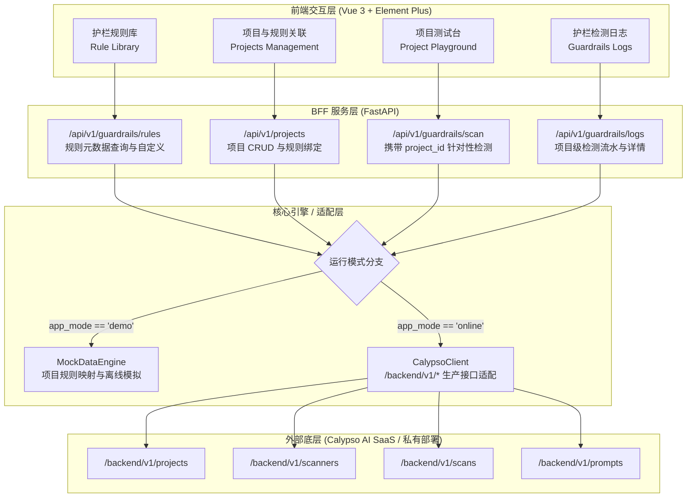

# Calypso AI 护栏体系与多项目关联重构设计文档 (Guardrails & Projects Refactoring Design)

## 1. 业务背景与重构目标

当前版本的「实时护栏测试台」仅提供了单一的 Prompt 输入与预设检测界面，缺乏与 Calypso AI 原生架构一致的**“规则配置 -> 项目空间创建 -> 规则与策略关联 -> 项目针对性测试 -> 原生日志留存”**的完整运营闭环。

本次重构旨在与 Calypso AI (F5 AI Security) 官方产品模型完全对齐：
1. **规则库与策略配置 (Guardrails Rules / Scanners)**：统一管理内置核心防护规则（提示词注入、越狱防御、凭证泄露、代码混淆、PII脱敏）与自定义安全规则（文明用语、政治敏感、业务合规等）。
2. **多项目管理与规则关联 (Projects & Rule Association)**：支持创建多个业务项目（如金融理财 Agent、研发代码助手、在线客服等），每个项目拥有唯一 `Project ID`，并按业务安全等级独立勾选与配置所关联的 Guardrails 规则（指定 Blocking / Flagging / Redacting 策略）。
3. **项目专属测试台 (Project-Scoped Playground)**：在测试界面中动态选择待测试的项目，直观展示该项目绑定的规则标签；测试输入严格基于该项目的 `project_id` 执行检测，验证当前项目规则是否生效。
4. **Calypso Guardrails 检测日志展示 (Scan Logs & Audit)**：在测试台与日志模块中直接展示 Calypso 原生 Guardrails 流水，实时联动项目维度日志，包含命中规则详情、脱敏比对、处理动作与元数据存证。
5. **双模式自适应 (Online & Demo)**：
   - **Online 生产模式**：直连 Calypso SaaS API (`/backend/v1/projects`, `/backend/v1/scanners`, `/backend/v1/scans`, `/backend/v1/prompts`)；
   - **Demo 离线演示模式**：在 MockDataEngine 中实现高保真多项目创建、规则动态关联、按项目策略模拟阻断/放行/脱敏与实时流水记录。

---

## 2. 核心架构与数据流设计



---

## 3. 详细模块设计

### 3.1 规则库管理 (Guardrails Rules)
- **预置规则**：
  - `prompt_injection`：系统指令覆盖、目标劫持与隐藏指令防御（默认 Blocking）
  - `jailbreak`：角色扮演对抗、DAN 越狱与恶意诱导（默认 Blocking）
  - `secrets_leak`：API Key、数据库密码、私钥与凭据拦截（默认 Blocking）
  - `obfuscation`：Base64/十六进制混淆还原对抗（默认 Blocking）
  - `pii_redaction`：身份证、大陆手机号、银行卡敏感脱敏（默认 Redact）
- **官方/自定义规则 (Scanners)**：
  - `文明用语` (ID: `019f9215-9c5a-7055-978d-237988b6ab60`)：侮辱性、歧视性词汇过滤
  - `政治敏感` (ID: `019f4a02-addd-7052-97d4-5a1bf7693fa9`)：政治相关违规内容过滤
  - `-Keyword-F5 topic only` / `F5 topic only`：特定行业领域关键词合规约束
- **规则元数据模型**：
  ```json
  {
    "id": "scanner_id",
    "name": "规则名称",
    "category": "injection | jailbreak | secrets | pii | custom",
    "direction": "request | response | both",
    "default_mode": "block | flag | redact",
    "description": "规则详细说明与拦截逻辑",
    "is_system": true,
    "enabled": true
  }
  ```

### 3.2 项目空间与规则关联 (Projects & Rule Binding)
- **项目定义**：
  - `id`: 唯一标识 UUID（如 `019f273c-1a5a-705a-9638-2798dbf3eb1e`）
  - `name`: 项目名称（如 `金融智能助理`、`Global`、`靶场测试`）
  - `type`: 业务类型（`chat`、`app`、`agentic`、`global` 等）
  - `description`: 项目用途说明
  - `config.scanners`: 关联的 Guardrails 规则清单，每个条目包含：
    - `id`: 规则 ID
    - `name`: 规则名称
    - `mode`: `"block"` | `"flag"` | `"redact"`
    - `blocking`: `true` | `false`
    - `enabled`: `true` | `false`
- **关联交互**：
  - 用户在创建/编辑项目弹窗中，通过穿梭框或复选卡片形式为该项目勾选生效的 Guardrail 规则。
  - 支持快捷一键应用模板配置（如“金融高合规模板”、“开发测试宽松模板”、“严格全量防御模板”）。

### 3.3 实时护栏测试台重构 (Playground with Project Context)
- **顶部项目控制区**：
  - **当前测试项目选择器 (Select Project)**：支持下拉切换，直接展示当前项目的 `Project ID`（支持一键复制）与项目类型徽章。
  - **生效规则流览 (Active Rules Tags)**：横向展示当前项目绑定的全部规则（如 `提示词注入 [阻断]`、`PII脱敏 [脱敏]`、`文明用语 [阻断]`）。
- **左侧输入与用例推荐**：
  - 测试输入框（Prompt）。
  - **智能用例联动**：根据当前项目已绑定的规则，高亮提示“推荐测试用例”（例如当前项目启用了 PII 脱敏，则突出展示 G08 个人信息脱敏用例；若启用了注入防御，则推荐 G01 用例）。
- **右侧测试评估结果**：
  - 判定结果大徽章（放行 Cleared、阻断 Blocked、脱敏 Redacted、警示 Flagged）。
  - **规则生效详情列表 (Evaluated Scanners)**：
    - 列出该项目下**每一条已绑定规则的执行状态**（通过 Passed / 触发阻断 Blocked / 敏感脱敏 Redacted）。
    - 针对未在该项目中绑定的规则，明确标识“项目未配置此规则（跳过）”，突出多项目规则差异化效果！
  - **PII 脱敏对比组件**：当触发脱敏时，左右对照高亮敏感数据掩码。
  - **大模型响应模拟/放行结果**：阻断时展示“请求已被护栏拦截，未透传至大模型”；放行时展示合规响应。

### 3.4 Calypso Guardrails 检测日志流展示 (Scan Logs Integration)
- **与测试台实时联动**：测试完成后，右下方或日志选项卡立即追加最新的一笔扫描流水。
- **日志列表展示项**：
  - 扫描 ID (`id`)
  - 项目标识 (`Project Name` / `Project ID`)
  - 请求时间 (`timestamp`)
  - 判定动作 (`outcome`)：带有红/绿/黄/紫状态标签
  - 输入 Prompt 缩略文本
  - 触发规则数量与名称
- **详情抽屉 (Drawer)**：
  - 完整 Prompt 内容快照与脱敏结果；
  - 完整的 `scannerResults` 规则判定数组与置信度元数据；
  - Calypso 原生响应 JSON 视图。

---

## 4. 后端接口设计 (`/api/v1/*`)

| 方法 | 路径 | 功能说明 |
| :--- | :--- | :--- |
| `GET` | `/api/v1/guardrails/rules` | 获取系统全部可用规则库列表（内置 + 自定义） |
| `POST` | `/api/v1/guardrails/rules` | 新增自定义安全规则（关键字/黑名单/正则表达式） |
| `GET` | `/api/v1/projects` | 获取所有项目列表及各项目关联的规则概况 |
| `POST` | `/api/v1/projects` | 创建新项目并绑定指定规则集合 |
| `GET` | `/api/v1/projects/{project_id}` | 获取单个项目的详细配置与关联规则 |
| `PUT` | `/api/v1/projects/{project_id}` | 更新项目基本信息与规则关联配置 |
| `DELETE` | `/api/v1/projects/{project_id}` | 删除项目 |
| `POST` | `/api/v1/guardrails/scan` | 携带 `project_id` 执行针对性安全检测 |
| `GET` | `/api/v1/guardrails/logs` | 查询护栏检测日志（支持 `project_id`、`outcome` 分页筛选） |

---

## 5. 质量保证与验证策略

1. **后端单元测试套件扩展**：
   - 编写 `tests/test_projects.py` 覆盖项目增删改查、规则关联与校验；
   - 扩展 `tests/test_guardrails_project_scoped.py` 验证不同项目绑定不同规则时的差异化判定表现；
   - 验证 Online 模式与 Demo 模式双向兼容。
2. **前端组件构建与验证**：
   - 构建 `GuardrailsView.vue` 整合规则、项目、测试台与日志四大模块；
   - 执行 `npm run build` 确保零告警与打包正常；
3. **真实生产连通与全链路验证**：
   - 在生产容器中通过 `chrome-devtools-mcp` 真实操控界面：
     - 查看官方已有项目（`Global`, `OF5AIGW集成` 等）及其规则；
     - 创建新项目并关联规则；
     - 在测试台上选择该项目进行输入测试，验证官方多维检测判定与日志产生；
     - 截图留存并输出至 Walkthrough 验证文档。
